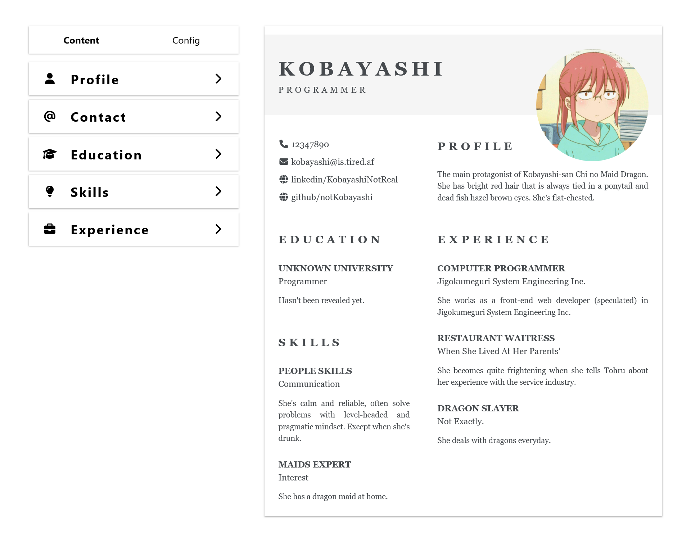

# Project: Resume Editor

This is a project assigned by TheOdinProject. For more information, please refer to [their curriculum](https://www.theodinproject.com/lessons/node-path-react-new-cv-application).

This project is designed to provide users (myself, actually) a simple and inituitive tool for creating and editing a CV application quickly. Whether you are seasoned professional or just starting your career, this applications aims to streamline to resume-building process, helping you to showcase your skills and experience effectively.

## Preview

Live on Vercel: https://resume-editor-lyart.vercel.app

## Features

- User-friendly Interface: The application offers a clean and intuitive user interface, making it easy for users to navigate and create/edit their resumes efficiently.

- Customization Options: Edit information of each section and customize the look of your resume.

- Real-time Preview: See changes to your resume in real-time as you make them, ensuring that you're happy with the final result before exporting.

- Save and Edit Later: Save your progress and come back to edit your resume at any time, allowing for flexibility and convenience.

## My ~~Rant~~ Thoughts

This is my first time get my hands on React library, and it feels refresh. I had to admit that using React makes the development process a lot easier and faster. If I had to make a comparison, working with vanilla JS would take a month for me to finish the same project (yes, I'm that incompetent, don't ask).

React has its best to offer: Props and Hooks. Props work the same as a normal function parameters. Therefore, it's easy to understand and use in application. Back then, when I have to use all kinds of tags attributes like class or dataset just to mimic a fraction of React's props power.

Hooks (or State) is eventhough a new concept, but I have a grasp of it easily as it immediately solve my problem with vanilla JS. Instead of creating global variables and having the components manipulate them altogether, React helps separate all of them as unique states and store them locally inside each component. This makes it easier to manage the state of the components (hence the name) as well as remove the step of changing the component's appearance manually as it reactively (pun intended) re-render it automatically.

In the end, React is cool. I love it. This is not sponsored by them.

...I would love to. But I understand I'm no one.
